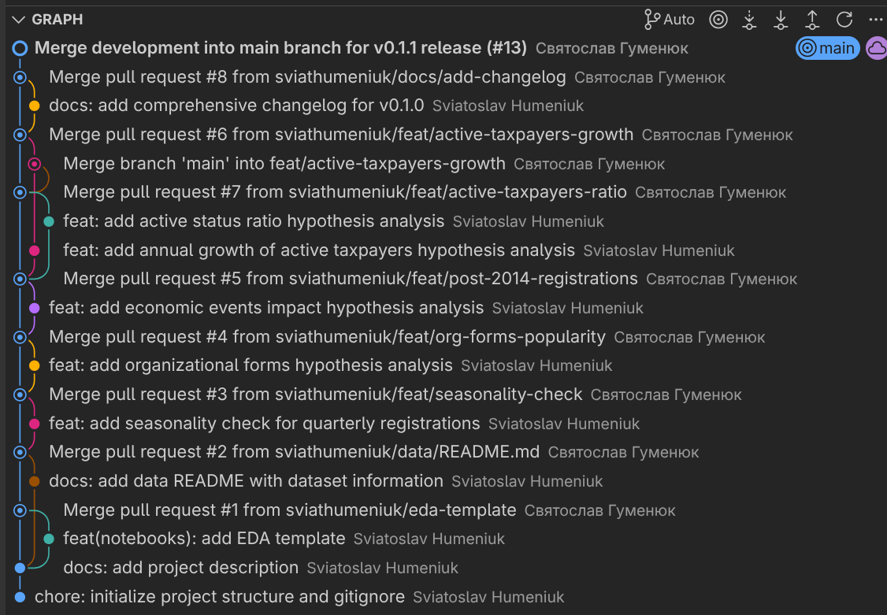
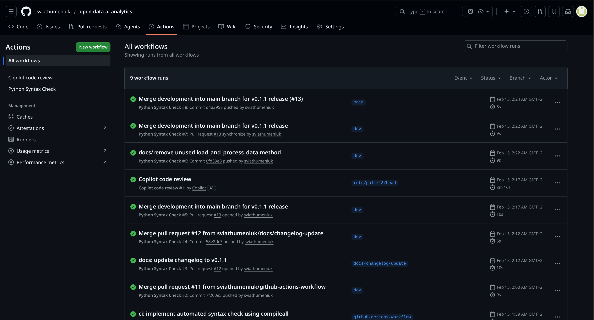

# Звіт по лабораторній роботі 1

## Посилання на репозиторій

**Repository:** https://github.com/sviathumeniuk/open-data-ai-analytics

## Що зроблено

У рамках лабораторної роботи було реалізовано повноцінний Git workflow з використанням feature branches, development branch та main branch. Створено модульну структуру проєкту з виділенням бізнес-логіки у окремі модулі (`src/analysis.py`, `src/data_processing.py`, `src/visualizations.py`, `src/config.py`). Реалізовано CI/CD pipeline через GitHub Actions для автоматичної перевірки синтаксису Python коду. Додано чотири гіпотези для аналізу даних про платників податків, включаючи сезонність реєстрацій, популярність організаційних форм, вплив економічних подій та статистику активних платників.

## Конфлікти та їх вирішення

Під час роботи виник конфлікт у головному файлі README при мердж pull requests з різних feature branches. Конфлікт виник через те, що у двох різних бренчах (`feat/active-taxpayers-growth` та `feat/active-taxpayers-ratio`) було додано четверту гіпотезу дослідження до файлу README.md незалежно один від одного. Як вирішення конфлікту було прийнято рішення залишити обидві гіпотези у файлі для можливої імплементації обох варіантів у майбутньому, адаптувавши нумерацію та структуру документа.

## Squash commits

Squash merge було застосовано двічі у процесі розробки:

1. **Перший squash:** При злитті refactor бренча (`refactor/update-src`) у development branch через PR #10. Це дозволило об'єднати множинні проміжні коміти рефакторингу (додавання config модуля, винесення логіки аналізу, функцій візуалізації, обробки даних) в один логічний коміт з чітким описом змін.

2. **Другий squash:** При злитті development branch у main через PR #13 для релізу v0.1.1, де потрібно було додати дрібний fix коміт (`docs/remove unused load_and_process_data method`) разом з іншими змінами, щоб історія main залишалася чистою та лінійною.

## Data Policy

Репозиторій містить `.gitignore` файл, який виключає з версійного контролю тимчасові файли Python (`__pycache__`), Jupyter checkpoints (`.ipynb_checkpoints`). Сирі дані зберігаються у папці `data/raw/` та включені до репозиторію, оскільки це відкритий датасет реєстру платників податків. Додано скрипт `scripts/get_data.py` для автоматичного завантаження даних.

## CI Pipeline

Налаштовано GitHub Actions workflow у файлі `.github/workflows/ci.yml`, який автоматично виконує перевірку синтаксису Python коду при кожному:

- **Push** у гілки `main` або `dev`
- **Pull Request** до гілок `main` або `dev`

Pipeline виконує команду `python -m compileall src`, яка компілює всі Python файли у директорії `src/` та перевіряє їх на наявність синтаксичних помилок. Використовується Python 3.14 на Ubuntu runner. Це дозволяє виявляти помилки на ранніх етапах розробки та забезпечує якість коду перед мерджем змін.

## Git Log

## Workflow Status

CI pipeline успішно налаштований та працює. Статус можна переглянути за посиланням:
https://github.com/sviathumeniuk/open-data-ai-analytics/actions

