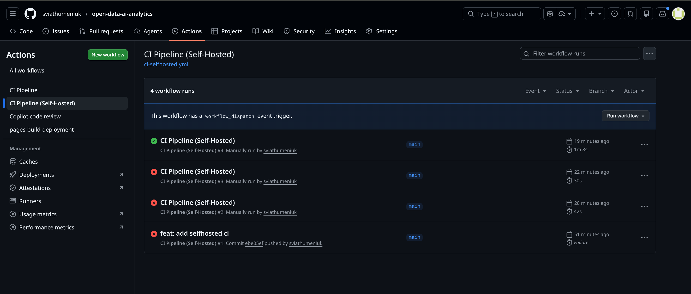
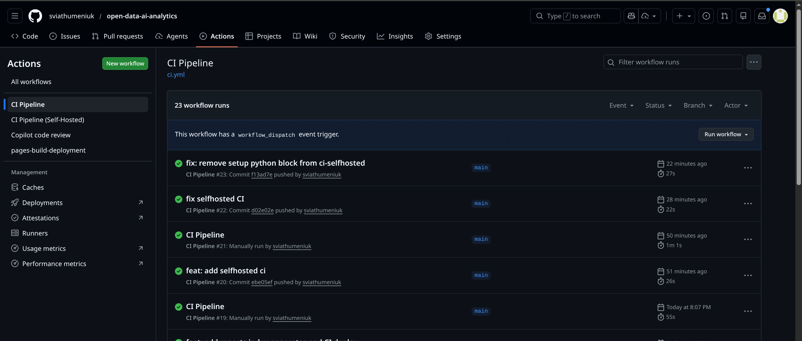

# Звіт по лабораторній роботі 2

## Посилання на репозиторій

**Repository:** https://github.com/sviathumeniuk/open-data-ai-analytics

## Частина A — CI для кожного модуля

### Структура pipeline

Налаштовано GitHub Actions workflow у файлі `.github/workflows/ci.yml`. Pipeline запускається у трьох випадках:

- **push** у гілку `main`
- **pull_request** у гілку `main`
- **вручну** через `workflow_dispatch` з можливістю обрати конкретний модуль (`all`, `data_processing`, `analysis`, `visualizations`)

### Паралельний запуск модулів через matrix

Для паралельного виконання використовується `strategy.matrix` з переліком модулів:

```yaml
strategy:
  fail-fast: false
  matrix:
    module: [data_processing, analysis, visualizations]
```

`fail-fast: false` гарантує, що при падінні одного модуля решта продовжують виконання незалежно.

### Виявлення змін

Додано окремий job `detect_changes` з використанням `dorny/paths-filter@v3`, який визначає, які модулі були змінені у поточному коміті:

```yaml
detect_changes:
  runs-on: ubuntu-latest
  outputs:
    data_processing: ${{ steps.filter.outputs.data_processing }}
    analysis: ${{ steps.filter.outputs.analysis }}
    visualizations: ${{ steps.filter.outputs.visualizations }}
  steps:
    - uses: actions/checkout@v4
    - uses: dorny/paths-filter@v3
      id: filter
      with:
        filters: |
          data_processing:
            - 'src/data_processing.py'
          analysis:
            - 'src/analysis.py'
          visualizations:
            - 'src/visualizations.py'
```

Завдяки цьому при автоматичному запуску (push/PR) pipeline перевіряє тільки ті модулі, файли яких дійсно змінились. При ручному запуску (`workflow_dispatch`) — запускається обраний модуль або всі одразу.

### Кроки для кожного модуля

Для кожного модуля виконуються такі кроки:

1. **Checkout code** — клонування репозиторію
2. **Set up Python** — встановлення Python 3.14
3. **Install dependencies** — `pip install -r requirements.txt`
4. **Run module check** — `python -m py_compile src/<module>.py`
5. **Generate results to artifacts/** — збереження log-файлу зі статусом виконання
6. **Upload audit artifact** — публікація артефактів у GitHub Actions

### Артефакти

Кожен модуль генерує артефакт `audit-<module>-<run_number>` зі структурою:

```
artifacts/
  data_processing/
    log.txt   # містить статус, run_id, event, module
  analysis/
    log.txt
  visualizations/
    log.txt
```

## Частина B — CD / Публікація результатів (GitHub Pages)

Обрано **Варіант 2**: публікація результатів візуалізації у GitHub Pages.

Додано job `deploy_pages` у `ci.yml`, який виконується виключно при `push` у `main` після успішного завершення `build_and_test`:

```yaml
deploy_pages:
  needs: build_and_test
  runs-on: ubuntu-latest
  if: github.event_name == 'push' && github.ref == 'refs/heads/main'
  steps:
    - name: Checkout code
      uses: actions/checkout@v4
    - name: Build reports index page
      run: python scripts/build_reports_index.py
    - name: Deploy reports to gh-pages
      uses: peaceiris/actions-gh-pages@v4
      with:
        github_token: ${{ secrets.GITHUB_TOKEN }}
        publish_branch: gh-pages
        publish_dir: ./reports
        force_orphan: true
```

Скрипт `scripts/build_reports_index.py` генерує `reports/index.html` із переліком усіх звітів і фігур. Після деплою результати доступні на GitHub Pages репозиторію.

## Частина C — Self-hosted runner

### Налаштування

Підключено self-hosted runner на локальній машині (Fedora OS). Runner зареєстрований у репозиторії через Settings → Actions → Runners і має мітки `self-hosted`, `linux`. Статус runner — **Idle** (очікує задачі).

Створено окремий workflow `.github/workflows/ci-selfhosted.yml`, який запускається **виключно вручну** (`workflow_dispatch`) і виконується на self-hosted runner:

```yaml
runs-on: [self-hosted, linux]
```

Workflow підтримує вибір модуля аналогічно до `ci.yml`, але без `detect_changes` job, оскільки призначений для ручної точкової перевірки. Артефакти містять додаткове поле `runner=${{ runner.name }}` для підтвердження виконання на self-hosted машині.

### Порівняння GitHub-hosted vs Self-hosted

| Критерій                         | GitHub-hosted                                                                    | Self-hosted                                                                                    |
| -------------------------------- | -------------------------------------------------------------------------------- | ---------------------------------------------------------------------------------------------- |
| **Швидкість**                    | Стабільна, залежить від навантаження на сервери GitHub                           | Залежить від заліза; на потужній машині може бути швидше, але без SSD може бути повільніше     |
| **Доступ до локальних ресурсів** | Немає доступу до локальних файлів; великі датасети потрібно завантажувати щоразу | Повний доступ до локального диску; великі CSV/датасети (`data/raw/`) доступні без завантаження |
| **Залежності**                   | Встановлюються з нуля при кожному запуску                                        | Можна кешувати локально; `.venv` може залишатись між запусками                                 |
| **Ризики — безпека**             | Ізольоване середовище GitHub; код не виконується на власній машині               | Код з PR виконується на вашій машині — небезпечно для публічних репозиторіїв                   |
| **Ризики — стабільність**        | GitHub гарантує uptime                                                           | Runner offline якщо машина вимкнена або немає мережі                                           |
| **Вартість**                     | Безкоштовно до ліміту хвилин                                                     | Безкоштовно, але витрачається ресурс власного ПК                                               |

### Проблема з версією Python

При першому запуску `ci-selfhosted.yml` виникла помилка:

```
The version '3.14' with architecture 'x64' was not found for this operating system.
```

Причина: `actions/setup-python` завантажує Python з попередньо зібраних бінарних пакетів GitHub, і Python 3.14 там ще відсутній. Вирішення — при використанні self-hosted runner на Fedora крок `Set up Python` можна пропустити, оскільки Python 3.14.3 вже встановлений локально:

```bash
python --version  # Python 3.14.3
```

## Workflow Status

CI pipeline успішно налаштований та працює. Статус можна переглянути за посиланням:
https://github.com/sviathumeniuk/open-data-ai-analytics/actions

Self-hosted runner підключений та активний. Результати виконання публікуються як артефакти у вкладці Actions.

## Screenshots

### Self-Hosted CI Pipeline Runs Overview



### GitHub-Hosted CI Pipeline Runs Overview


